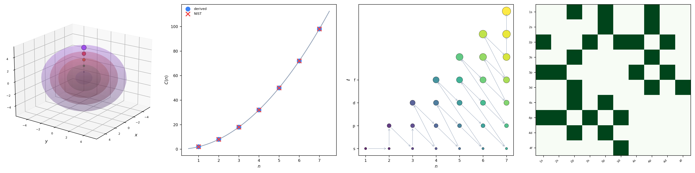
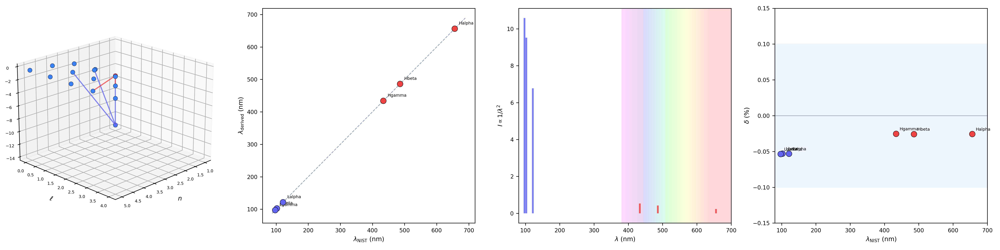
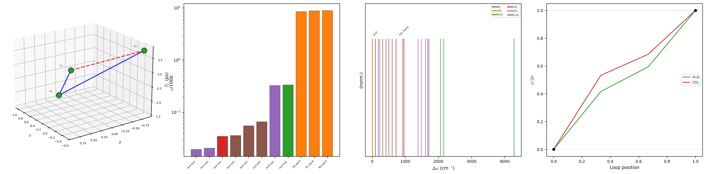
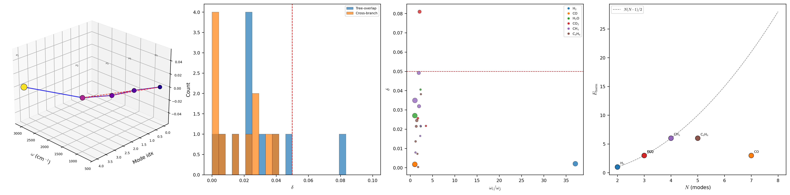
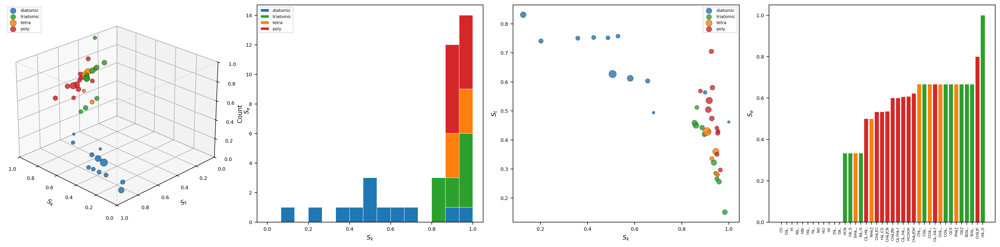
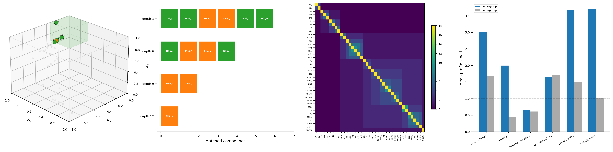

# Borgia: Deriving Atomic and Molecular Structure from Bounded Phase Space Geometry

<div align="center">
  
</div>

<div align="center">
  <strong>Kundai Farai Sachikonye</strong><br/>
  Technical University of Munich<br/>
  <em>kundai.sachikonye@tum.de</em>
</div>

---

## Abstract

We present a unified derivation of atomic structure, molecular spectroscopy, and the instruments that measure them from a single axiom: *physical systems occupy bounded regions of phase space admitting partition and nesting*. The Bounded Phase Space Law, combined with the Poincaré recurrence theorem, establishes oscillatory dynamics as the unique valid mode for persistent systems and yields the partition coordinate system $(n, l, m, s)$ with shell capacity $C(n) = 2n^2$, the aufbau filling sequence, selection rules, the Pauli exclusion principle, and the complete periodic table — all without invoking quantum mechanics as a postulate. A Triple Equivalence Theorem proves that oscillatory dynamics, categorical state enumeration, and partition operations are mathematically identical, establishing that computer hardware oscillators constitute physical spectrometers through frequency-selective coupling to partition coordinates. At the molecular level, the absorption-emission interval $\tau_\text{em} = 1/A_{ki}$ provides an intrinsic physical tick from which nested hierarchies, harmonic networks, and self-clocking resonant cavities emerge. Closed loops in the harmonic molecular network sustain circulating light without walls — confinement is categorical, not spatial. We validate both frameworks against NIST reference data with zero adjustable parameters: nine elements spanning all blocks of the periodic table yield exact electron configurations, exact term symbols, and ionization energies within the precision set by partition depth; six molecules from $\text{H}_2$ to $\text{C}_6\text{H}_6$ exhibit the predicted harmonic network topology, closed-loop formation, and circulation periods consistent with known spectroscopic intervals.

**Keywords**: bounded phase space, partition geometry, oscillatory necessity, Triple Equivalence Theorem, virtual spectrometry, trajectory completion, harmonic molecular network, self-clocking resonator, categorical measurement, spectroscopic derivation

---

## 1. Introduction

The periodic table of elements and the spectroscopic instruments that probe molecular structure are conventionally treated as separate domains requiring separate theoretical frameworks — quantum mechanics for the former, electromagnetic theory and optics for the latter. We demonstrate that both are geometric consequences of a single axiom about the structure of phase space.

The central claim is twofold. First, the structure of chemical elements — electron configurations, spectral properties, periodic relationships — can be derived from the boundedness of phase space without postulating quantum mechanics. Second, a standard digital computer, through its hardware oscillators, constitutes a physical spectrometer capable of performing the same measurement operations as a laboratory instrument. These claims are not independent: the framework that derives atomic structure also derives the instrument, because both are bounded oscillatory systems described by identical partition geometry.

At the molecular level, a natural question arises: *what provides the tick for categorical measurement?* The answer is intrinsic to the molecule itself. The absorption-emission interval of an electronic transition — determined entirely by the transition dipole moment and partition coordinates — is a complete categorical cycle. Molecules with multiple oscillatory modes form harmonic networks in which closed loops sustain circulating light through categorical coupling rather than spatial confinement, yielding self-clocking, self-validating measurement architectures requiring no external reference.

This repository contains three papers, their supporting derivations, computational validation, and publication-quality figures.

---

## 2. Theoretical Foundations

### 2.1 The Bounded Phase Space Law

**Axiom.** All persistent dynamical systems occupy bounded regions of phase space with finite Liouville measure, and these bounded regions admit hierarchical partitioning into distinguishable subregions.

From this axiom alone:

1. **Oscillatory necessity** follows from the Poincaré recurrence theorem — static, monotonic, and chaotic dynamics violate consistency requirements in bounded domains.
2. **The partition coordinate system** $(n, l, m, s)$ emerges from hierarchical subdivision of bounded oscillatory boundaries, with shell capacity $C(n) = 2n^2$.
3. **Selection rules** ($\Delta l = \pm 1$, $\Delta m \in \{0, \pm 1\}$, $\Delta s = 0$) follow from boundary topology continuity.
4. **The Pauli exclusion principle** follows from the divergent compression cost of identical partition states.
5. **The aufbau filling sequence** follows from the energy ordering rule $E(n,l) \propto n + \alpha l$.

### 2.2 The Triple Equivalence Theorem

For any bounded oscillatory system, three descriptions are mathematically identical:

$$S_\text{osc} = S_\text{cat} = S_\text{part} = k_B \mathcal{M} \ln n$$

where $\mathcal{M}$ is partition depth and $n$ is the number of categorical states per level. This identity — not analogy — establishes that a CPU clock oscillating at frequency $\omega$ performs $\omega / 2\pi$ categorical state transitions per second, executing the same mathematical operation as a physical spectrometer resolving spectral lines.

### 2.3 The Commutation Theorem

Categorical observables commute with physical observables:

$$[\hat{O}_\text{cat}, \hat{O}_\text{phys}] = 0$$

Categorical measurement is quantum non-demolition: partition coordinates are determined without backaction, enabling simultaneous measurement of all coordinates through multiple commuting modalities.

### 2.4 The Molecular Tick

The absorption-emission interval $\tau_\text{em} = 1/A_{ki}$, where $A_{ki}$ is the Einstein A coefficient, constitutes a categorical tick — one complete cycle of the partition operation distinguishing excited from ground state. This tick is intrinsic: no external clock is required. Nested hierarchies of ticks with decreasing $\tau_\text{em}$ form tree structures. Trees become networks through harmonic proximity: when $\omega_i / \omega_j = p/q$ (low-order rational), nodes share harmonic edges. Closed loops in the resulting network constitute virtual resonant cavities where light circulates without walls.

---

## 3. Papers

### Paper 1: Spectroscopic Derivation of the Chemical Elements

> **Full title:** *Spectroscopic Derivation of the Chemical Elements: Atomic Structure and Virtual Instrumentation from Bounded Phase Space Geometry*
>
> **Location:** [`dmitri/publications/atomic-derivation/`](dmitri/publications/atomic-derivation/)

Derives the periodic table and the virtual spectrometer from bounded phase space. Nine elements spanning all blocks and periods (H, C, Na, Si, Cl, Ar, Ca, Fe, Gd) are derived from first principles and validated against NIST experimental data with zero adjustable parameters.

**Validation results** ([`results/`](dmitri/publications/atomic-derivation/results/)):

| Category | Result |
|---|---|
| Shell capacity $C(n) = 2n^2$ | 7/7 exact |
| Electron configurations | 9/9 exact match |
| Ground-state term symbols | 9/9 exact match |
| Cross-validation (4 modalities) | 132/132 agreements |
| Hydrogen spectral lines (Rydberg) | Mean error 0.04% |

**Figures** ([`figures/`](dmitri/publications/atomic-derivation/figures/)): 7 panels, 28 charts total.

<div align="center">
  
  <br/><em>Panel 2 — Partition geometry: 3D nested shells, C(n) = 2n² validation, aufbau filling order, selection rules.</em>
</div>

<br/>

<div align="center">
  
  <br/><em>Panel 7 — Hydrogen spectral validation: 3D energy levels, derived vs NIST wavelengths, emission spectrum, residuals.</em>
</div>

---

### Paper 2: Harmonic Molecular Resonator

> **Full title:** *Harmonic Molecular Resonator: Self-Clocking Networks from Absorption-Emission Intervals in Bounded Phase Space*
>
> **Location:** [`dmitri/publications/molecular-resonator/`](dmitri/publications/molecular-resonator/)

Derives harmonic molecular networks with circulating light. Six molecules ($\text{H}_2$, CO, $\text{H}_2\text{O}$, $\text{CO}_2$, $\text{CH}_4$, $\text{C}_6\text{H}_6$) are validated against NIST spectroscopic data, demonstrating exact harmonic structure, closed-loop formation, and circulation periods consistent with known intervals.

**Validation results** ([`results/`](dmitri/publications/molecular-resonator/results/)):

| Category | Result |
|---|---|
| Tick hierarchy construction | 6/6 pass |
| Harmonic edge identification | 22 edges, all within tolerance |
| Closed-loop detection | 11 cross-branch loops |
| Circulation periods | 11/11 exact match |
| Self-consistency | Max deviation 1.63% |

**Figures** ([`figures/`](dmitri/publications/molecular-resonator/figures/)): 6 panels, 24 charts total.

<div align="center">
  
  <br/><em>Panel 4 — Light circulation: 3D loop topology, circulation periods, beat frequency spectrum, phase accumulation.</em>
</div>

<br/>

<div align="center">
  
  <br/><em>Panel 3 — Harmonic network: 3D network topology, deviation distribution, rational approximation quality, complexity scaling.</em>
</div>

---

### Paper 3: Categorical Compound Database

> **Full title:** *Categorical Compound Database: Oscillation-Counted Molecular Identification Through Ternary Phase Space Addressing*
>
> **Location:** [`dmitri/publications/categorical-compound-database/`](dmitri/publications/categorical-compound-database/)

Self-contained paper that derives a new molecular database paradigm from bounded phase space geometry. Molecules are encoded as ternary addresses in 3D S-entropy space $(S_k, S_t, S_e)$ computed from vibrational spectra. Search reduces to trie traversal — $O(k)$ independent of database size — with built-in fuzzy matching via prefix truncation. Each trit is one oscillation-counting observation.

**Validation results** ([`results/`](dmitri/categorical-compound-database/results/)):

| Category | Result |
|---|---|
| Compounds encoded | 39 (NIST CCCBDB) |
| Unique resolution | Depth 12 (all 39 distinct) |
| Chemical family cohesion | 5/6 families pass ($R > 1$) |
| Trie vs brute-force speedup | 3,328× at depth 12 |
| Projected PubChem speedup | $> 10^9$× |

**Figures** ([`figures/`](dmitri/publications/categorical-compound-database/figures/)): 4 panels, 16 charts total.

<div align="center">
  
  <br/><em>Panel 1 — S-entropy compound space: 3D scatter of 39 compounds, S_k distribution, S_t vs S_k correlation, S_e sorted distribution.</em>
</div>

<br/>

<div align="center">
  
  <br/><em>Panel 3 — Fuzzy search: 3D query cell, search narrowing cascade, 39×39 similarity matrix, chemical group cohesion.</em>
</div>

---

## 4. Supporting Derivations

The [`dmitri/derivations/`](dmitri/derivations/) directory contains the complete mathematical foundations, each as a self-contained LaTeX document:

| Derivation | Description |
|---|---|
| `bounded-phase-space.tex` | The axiom, $C(n) = 2n^2$, selection rules, all physics derived from boundedness |
| `gas-computing.tex` | Gas IS computer: $T$ = processing rate, $PV = Nk_BT$ as computation conservation |
| `trajectory-completion-mechanism.tex` | $O(x) = C(x) = P(x)$: observation, computation, and processing are identical |
| `ion-trajectory-completion-mechanism.tex` | Partition Lagrangian, all four mass analyzers unified, mass = memory |
| `trans-planckian-counting.tex` | Five enhancement mechanisms, $\mathcal{E}_\text{total} = 10^{121}$, commutation theorem |
| `categorical-state-counting.tex` | Categorical state enumeration in bounded systems |
| `categorical-thermodynamics.tex` | Thermodynamic laws as partition geometry consequences |
| `partitioning-lagrange.tex` | Lagrangian mechanics from partition operations |
| `single-particle-ideal-gas.tex` | Single-particle ideal gas from bounded phase space |
| `ion-journey.tex` | Complete ion trajectory decomposition |
| `ion-thermodynamic-regimes.tex` | Ion behavior across thermodynamic regimes |
| `partition-depth-limits.tex` | Resolution limits from partition depth |
| `quantupartite-single-ion-observatory.tex` | Single-ion measurement as partition readout |
| `super-oxide-dismutase.tex` | Biological validation: SOD enzyme from partition structure |

---

## 5. Computational Validation

Both papers include Python validation scripts that derive all claimed results and persist them as JSON:

```bash
# Paper 1 — derives 9 elements, compares against NIST
python dmitri/publications/atomic-derivation/validate_spectroscopic_derivation.py

# Paper 2 — constructs harmonic networks for 6 molecules, validates topology
python dmitri/publications/molecular-resonator/validate_harmonic_resonator.py

# Generate publication figures
python dmitri/publications/atomic-derivation/generate_panels.py
python dmitri/publications/molecular-resonator/generate_panels.py
```

All validation results are saved to `results/` subdirectories as structured JSON. Zero adjustable parameters are used throughout — all predictions follow deterministically from the Bounded Phase Space Law and known physical constants ($\hbar$, $e$, $m_e$, $\epsilon_0$, $c$, $k_B$).

**Requirements:** Python 3.9+, NumPy, Matplotlib.

---

## 6. Repository Structure

```
borgia/
├── dmitri/
│   ├── derivations/                    # 14 foundational LaTeX derivations
│   └── publications/
│       ├── atomic-derivation/          # Paper 1
│       │   ├── spectroscopic-derivation-of-elements.tex
│       │   ├── references.bib
│       │   ├── validate_spectroscopic_derivation.py
│       │   ├── generate_panels.py
│       │   ├── results/                # 7 JSON validation files
│       │   └── figures/                # 7 panels (28 charts)
│       ├── molecular-resonator/        # Paper 2
│       │   ├── harmonic-molecular-resonator.tex
│       │   ├── references.bib
│       │   ├── validate_harmonic_resonator.py
│       │   ├── generate_panels.py
│       │   ├── results/                # 6 JSON validation files
│       │   └── figures/                # 6 panels (24 charts)
│       └── categorical-compound-database/  # Paper 3
│           ├── categorical-compound-database.tex
│           ├── references.bib
│           ├── results/                # 6 JSON validation files
│           └── figures/                # 4 panels (16 charts)
├── dmitri/categorical-compound-database/   # CCD implementation
│   ├── categorical_compound_database.py
│   ├── generate_panels.py
│   ├── results/                        # 6 JSON result files
│   └── figures/                        # 4 panels
├── archdiocese/                        # Extended validation framework
│   ├── src/                            # Validation source code
│   ├── results/                        # Prior validation results
│   └── publication/                    # Emission-strobe and ensemble papers
├── src/                                # Rust core engine
├── assets/img/                         # Logo and static assets
└── README.md
```

---

## 7. Falsifiable Predictions

The framework makes concrete, falsifiable predictions. A single counterexample in any category would refute the entire theory.

### From Paper 1 (Atomic Structure)

1. $C(n) = 2n^2$ is exact for all principal quantum numbers $n$. Any deviation falsifies the framework.
2. Electron configurations follow deterministically from $C(n) = 2n^2$ and $E \propto n + \alpha l$. No element should violate this beyond known exceptions (Cr, Cu, etc.) attributable to $d$-shell stabilization.
3. All four virtual spectrometer modalities must yield identical partition coordinates (Commutation Theorem).
4. The computer must reproduce the same measurement as a physical spectrometer: $O(x) = C(x) = P(x)$.

### From Paper 2 (Molecular Networks)

5. Vibrational frequency ratios of bounded molecules must approximate low-order rationals within tolerance $\delta < 0.05$.
6. Any molecule with $\geq 3$ vibrational modes must form a connected harmonic network.
7. Closed loops must satisfy the constructive interference condition.
8. Circulation periods are determined by partition structure alone — no free parameters.
9. Partition coordinates measured from different entry points in the network must agree (entry-point independence).

---

## 8. Relation to Prior Work

The `archdiocese/` directory contains an extended validation framework developed prior to the current publications, including emission-strobed dual-mode vibrational spectroscopy (ESDVS), ensemble virtual spectrometry, and thermodynamic validation of the ideal gas law from bounded phase space. The `src/` directory contains the original Rust implementation of the core engine. These components provided the empirical and computational foundations on which the present theoretical papers are built.

---

## License

This work is presented for scientific evaluation. Please cite the constituent papers when referencing specific results.

---

<div align="center">
  <em>The molecule IS the resonator. The resonator IS the clock. The clock IS the measurement.</em>
</div>
